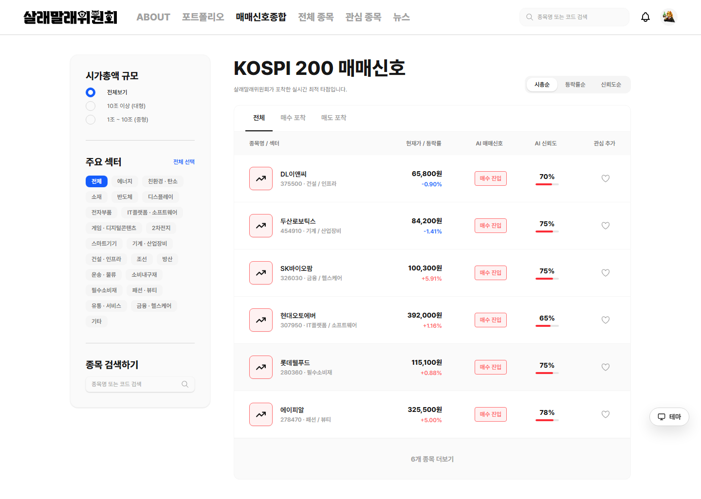
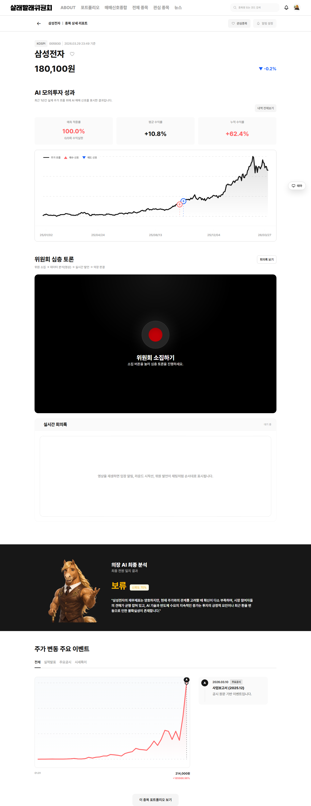
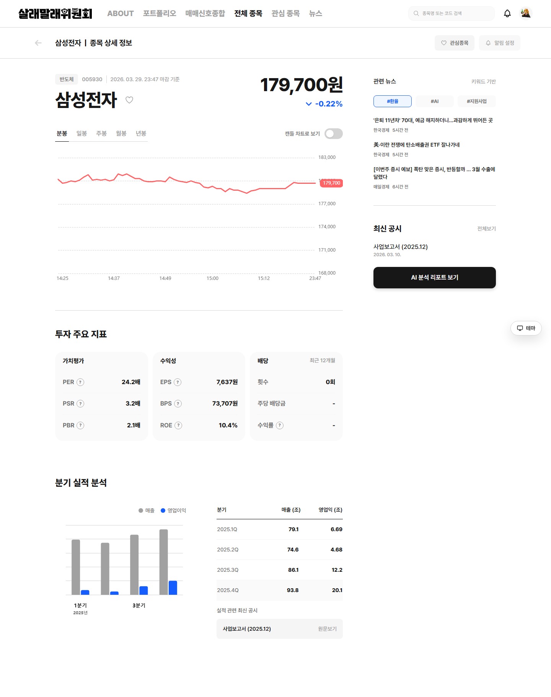
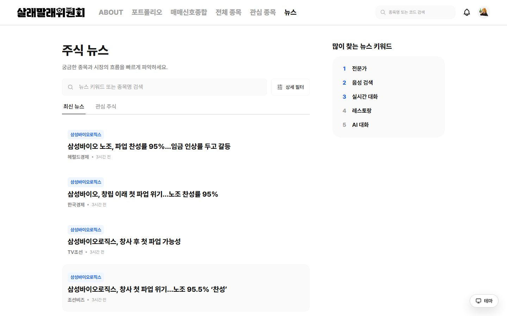
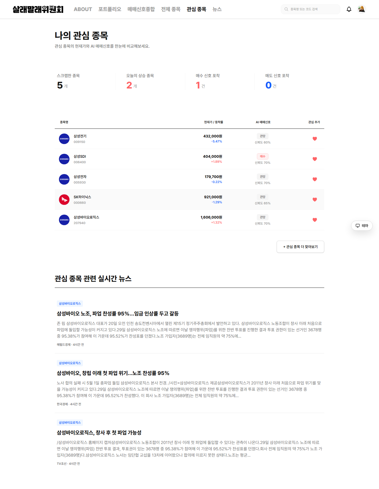
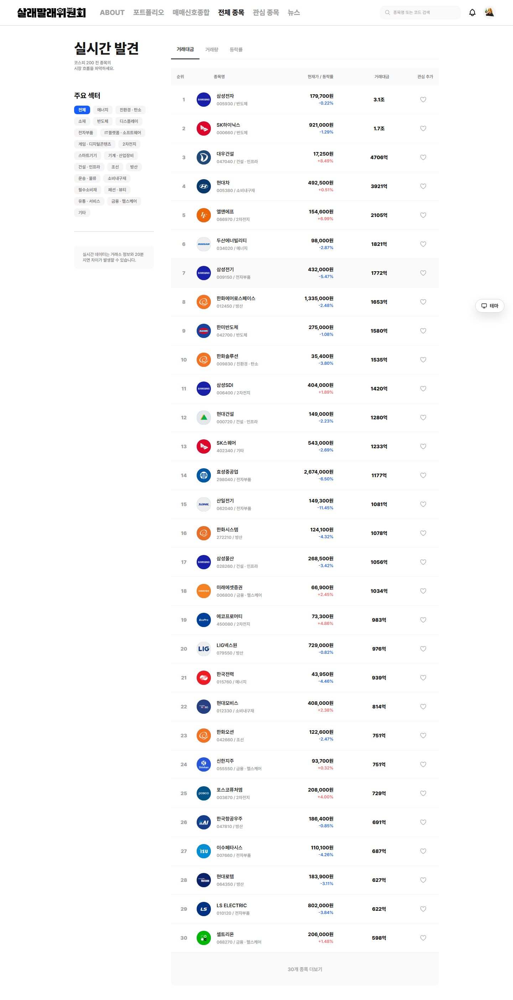
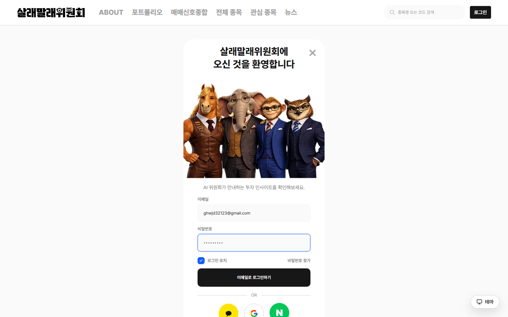
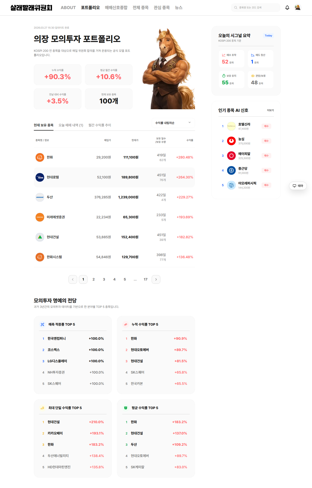
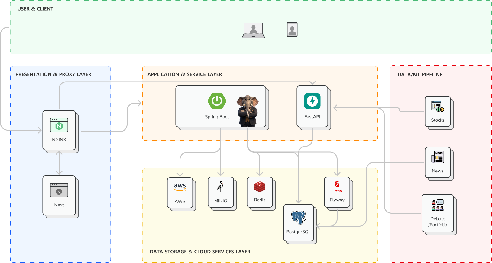
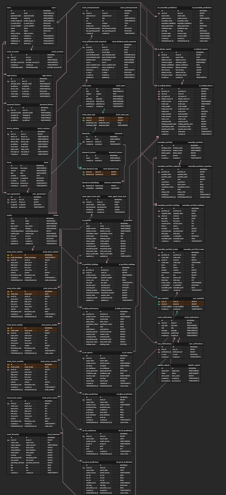

# 살래말래

> AI 기반 주식 추천 및 분석 통합 서비스

종목, 뉴스, 공시, 재무, AI 분석 결과를 한 화면에서 통합 제공하며, 정량 모델과 AI 토론 결과를 함께 보여주는 종목 리포트, AI 매매신호, 관심종목, 알림, 검색 기능을 제공합니다.


---

## **📑** 목차

1. [프로젝트 소개](#-프로젝트-소개)
2. [주요 기능](#-주요-기능)
3. [기술 스택](#️-tech-stack)
4. [프로젝트 구조](#-프로젝트-구조)
5. [아키텍처](#️-아키텍처)
6. [ERD](#-erd)
7. [설치 및 실행 방법](#️-설치-및-실행-방법)
8. [공통 파트](#공통-파트)
9. [담당 파트](#-담당-파트)
10. [기타 정보](#기타-정보)

---

## **📋** 프로젝트 소개

**살래말래**는 SSAFY(삼성 청년 SW 아카데미) 프로젝트로 개발된 AI 기반 주식 추천/분석 통합 서비스입니다.

KOSPI 200 종목을 대상으로 LightGBM, TFT, GARCH 등 머신러닝 모델의 앙상블 예측과 LLM 기반 AI 토론 시스템을 결합하여 매매 신호를 생성합니다. 사용자는 종목별 재무 데이터, 뉴스 감성 분석, AI 리포트를 한 화면에서 확인할 수 있으며, 관심종목 알림과 실시간 시세 스트리밍을 통해 투자 의사결정을 지원받을 수 있습니다.

---

## **🚀** 주요 기능

### 1. AI 매매 신호 및 종목 리포트

LightGBM, TFT, GARCH 모델의 앙상블 예측과 LLM 기반 AI 토론(매수/매도 에이전트 + 의장 판정)을 통해 종목별 매매 신호(BUY/SELL/HOLD/STAY)를 생성합니다. 의장 리포트와 토론 로그를 함께 제공하여 신호의 근거를 투명하게 확인할 수 있습니다.




<br />

### 2. 종목 상세 분석

종목별 재무 데이터(매출, 영업이익, PER/PBR/ROE), OHLCV 차트(분/일/주/월/년봉), 공시 정보, 뉴스 감성 분석 결과를 통합하여 제공합니다. TimescaleDB 기반의 시계열 데이터로 빠른 차트 로딩을 지원합니다.



<br />

### 3. 뉴스 감성 분석 및 키워드

FinBERT 기반 뉴스 감성 분석과 키워드 클러스터링을 통해 종목별 시장 분위기를 파악할 수 있습니다. pgvector를 활용한 384차원 키워드 임베딩으로 관련 키워드 검색을 지원합니다.



<br />

### 4. 관심종목 및 알림

종목을 관심목록에 등록하면 급등(SURGE), 급락(PLUNGE), 매수 신호(SIGNAL_BUY), 매도 신호(SIGNAL_SELL) 발생 시 실시간 SSE 알림을 받을 수 있습니다. 종목별/전체 알림 ON/OFF 설정이 가능합니다.



<br />

### 5. 실시간 시세 스트리밍

한국투자증권 Open API WebSocket을 통해 실시간 주가 및 호가 데이터를 스트리밍합니다. SSE(Server-Sent Events)로 프론트엔드에 실시간 시세를 전달합니다.



<br />

### 6. 소셜 로그인 및 인증

Google, Naver, Kakao OAuth 2.0 소셜 로그인과 이메일 회원가입을 지원합니다. JWT 기반 Stateless 인증, 디바이스 세션 관리, 5회 실패 시 계정 잠금 등 보안 기능을 제공합니다.



<br />

### 7. AI 포트폴리오 (의장 포트폴리오)

AI 토론 결과를 기반으로 자동 구성되는 모의 포트폴리오입니다. 초기 자본 1억원 기준으로 매매를 시뮬레이션하며, 일별 수익률, 누적 수익률, MDD 등 성과 지표를 제공합니다.



---

## 🛠️ Tech Stack

### 💻 Frontend


### ⚙️ Backend


### 🤖 AI


### 🗄️ Database & Storage


### ☁️ Infrastructure & Deployment


### Collaboration Tools


---

## **📂** 프로젝트 구조

### **📦** Frontend

```
services/frontend/src/
├── app/                            # Next.js App Router 페이지
│   ├── api/auth/                   # 인증 API Route
│   └── ...                         # 페이지별 라우트
├── features/                       # 기능별 모듈
│   ├── auth/                       # 인증 (로그인, 회원가입, OAuth)
│   ├── stock/                      # 종목 (상세, 차트, 재무)
│   ├── report/                     # AI 리포트 (토론, 매매신호)
│   ├── news/                       # 뉴스 (감성분석, 키워드)
│   ├── watchlist/                  # 관심종목
│   ├── notification/               # 알림
│   ├── search/                     # 검색 (자동완성, 인기종목)
│   └── main/                       # 메인 (시장지수, 추천)
├── shared/                         # 공유 모듈
│   ├── components/                 # 공통 컴포넌트 (AppProviders 등)
│   └── lib/                        # API 클라이언트 (apiFetch, SSE)
└── ...
```

### **🖥️** Backend

```
services/backend/src/main/java/com/sallaemallae/backend/
├── domain/                         # 도메인별 비즈니스 로직
│   ├── auth/                       # 인증 (이메일/소셜 로그인, OAuth)
│   │   ├── controller/
│   │   ├── service/
│   │   ├── oauth/                  # Google, Naver, Kakao OAuth 클라이언트
│   │   └── dto/
│   ├── user/                       # 사용자 (프로필, 관심종목, 알림 설정)
│   ├── policy/                     # 약관 (서비스, 개인정보, 투자면책)
│   ├── main/                       # 메인 (시장 요약, 추천, 포트폴리오)
│   ├── stock/                      # 종목 (목록, 상세, 시세)
│   ├── report/                     # 리포트 (ML 분석, AI 토론)
│   ├── signal/                     # 매매 신호 (AI 시그널)
│   ├── news/                       # 뉴스 (감성분석, 키워드)
│   ├── notification/               # 알림 (원본/사용자별, SSE)
│   ├── search/                     # 검색 (자동완성, 인기종목, 이력)
│   └── health/                     # 헬스체크
├── global/                         # 공통 인프라
│   ├── config/                     # Spring 설정 (Security, Redis, MinIO, Swagger)
│   ├── exception/                  # 전역 예외 처리
│   ├── response/                   # 표준 API 응답 포맷
│   ├── security/                   # JWT 필터, 인증 핸들러
│   └── email/                      # 이메일 서비스 (인증, 비밀번호 재설정)
└── infra/                          # 외부 연동
    ├── kis/                        # 한국투자증권 API (REST + WebSocket)
    └── ai/                         # ML 추론 서버 클라이언트
```

### **🤖** AI

```
services/ai/
├── 1_data_pipeline/                # 데이터 수집 파이프라인
│   ├── stock/                      # 주식 데이터 (OHLCV, 수급, 재무, 매크로)
│   │   ├── pipeline.py             # 메인 파이프라인 (initial/incremental)
│   │   ├── scheduler.py            # 일일 스케줄러 (16:30 KST)
│   │   ├── collectors/             # 데이터 수집기 (DART, FRED, KRX, KIS)
│   │   └── features/               # 피처 엔지니어링
│   └── news/                       # 뉴스 크롤링 & 키워드 추출
│       ├── crawlers/               # 네이버 금융 크롤러
│       ├── extractors/             # 키워드 추출 (Gemini/Claude)
│       └── scheduler.py            # 일일 스케줄러 (16:00 KST)
├── 2_ml_pipeline/                  # ML 모델 학습 & 추론
│   ├── models/                     # LightGBM, TFT, GARCH, Ensemble
│   └── scripts/                    # daily_inference.py, catchup_inference.py
├── 3_ai_server/                    # FastAPI 추론 서버
│   ├── main.py                     # 앱 진입점 (uvicorn)
│   ├── routers/                    # API 엔드포인트 (/ai/*)
│   └── scripts/                    # 포트폴리오 반영 스크립트
└── 4_debate_worker/                # LLM 토론 워커
    ├── daily_main.py               # 일일 자동화 오케스트레이터
    └── worker/                     # 토론 엔진, LLM 클라이언트
```

---

## **🏗️** 아키텍처



```
[Client Browser]
       │
       ▼
[Gateway Nginx] (:80/:443)  ─── j14d208.p.ssafy.io
       │
       ├── /          → Frontend (Next.js :3000)
       ├── /api/      → Backend  (Spring Boot :8080)
       ├── /ai/       → AI Server (FastAPI :8000)
       └── /assets/   → MinIO (:9000)
                              │
              ┌───────────────┼───────────────┐
              ▼               ▼               ▼
        [PostgreSQL 16]   [Redis 7]      [MinIO]
        TimescaleDB       Cache/Token    Profile Images
        pgvector          Session
        pg_trgm

[AI Pipeline]
  Data Collection → Feature Engineering → ML Training/Inference → LLM Debate → Portfolio
  (Stock/News)      (base_features)       (LightGBM,TFT,GARCH)   (Gemini/Claude)
```

---

## **📚** ERD



### 테이블 관계 요약

| 관계 | 타입 | 설명 |
|------|------|------|
| users → social_accounts | 1:N | 한 유저가 여러 소셜 계정 연동 |
| users → login_history | 1:N | 로그인/로그아웃 이벤트 이력 |
| users → device_sessions | 1:N | 멀티 디바이스 세션 관리 |
| users → user_watchlist → stocks | N:M | 관심종목 (알림 ON/OFF) |
| users → user_notifications → stock_notifications | N:M | 사용자별 알림 읽음 관리 |
| stocks → stock_prices_* | 1:N | 분/일/주/월/년봉 시세 |
| stocks → stock_financials | 1:N | 분기별 재무 데이터 |
| stocks → stock_news_map → stock_news | N:M | 종목-뉴스 감성 매핑 |
| stocks → ai_ml_reports | 1:N | ML 분석 리포트 |
| stocks → ai_debate_reports | 1:N | AI 토론 리포트 |
| ai_portfolio → ai_trading_history | 1:N | AI 매매 이력 |
| ai_portfolio → ai_portfolio_holdings | 1:N | 포트폴리오 보유 종목 |

---

## **⚙️** 설치 및 실행 방법

### 사전 요구 사항

- Docker & Docker Compose
- Node.js 22+ (pnpm)
- Java 21 (JDK 21, Eclipse Temurin)
- Python 3.12+ (AI 서버)
- Maven 3.9.9+

### Docker Compose로 전체 실행

> 상세한 배포 및 설정 방법은 [포팅 메뉴얼](1_빌드_및_배포_가이드.md)을 참고하세요.

```bash
# 저장소 클론
git clone https://lab.ssafy.com/s14-bigdata-recom-sub1/S14P21D208.git
cd S14P21D208

# Base 인프라 기동 (PostgreSQL + Redis + MinIO)
cd infra
cp env/base.env.example env/base.env          # 편집 필요
docker compose -f base/docker-compose.base.yml --env-file env/base.env up -d

# 전체 통합 배포
cp env/develop.env.example env/develop.env    # 편집 필요
docker compose -f apps/docker-compose.full.yml --env-file env/develop.env up -d --build
```

실행 후 서비스 접속 정보:

| 서비스 | 포트 | 설명 |
|--------|------|------|
| Gateway (Nginx) | 80 / 443 | 공용 진입점 (j14d208.p.ssafy.io) |
| Frontend (Next.js) | 3000 | 웹 애플리케이션 |
| Backend (Spring Boot) | 8080 | REST API 서버 |
| AI Server (FastAPI) | 8000 | ML 추론 서버 |
| PostgreSQL | 5432 | 데이터베이스 (TimescaleDB) |
| Redis | 6379 | 캐시 / 토큰 관리 |
| MinIO | 9000 / 9001 | 오브젝트 스토리지 / 관리 콘솔 |
| Prometheus | 9090 | 메트릭 수집 |
| Grafana | 3001 | 모니터링 대시보드 |

### 로컬 개발 환경 (개별 실행)

**Backend**

```bash
cd services/backend
./mvnw spring-boot:run
```

**Frontend**

```bash
cd services/frontend
corepack enable
pnpm install
pnpm dev
```

**AI Server**

```bash
cd services/ai/3_ai_server
pip install -r requirements.txt
uvicorn main:app --host 0.0.0.0 --port 8000
```

### 환경 변수

> 환경 변수 상세는 [포팅 메뉴얼 - 환경 변수](1_빌드_및_배포_가이드.md#4-환경-변수-상세), 외부 서비스 정보는 [외부 서비스 정보](2_외부_서비스_정보.md)를 참고하세요.

---

## 공통 파트

- Git 컨벤션 준수
- 코드 리뷰 진행
- 기술 문서 작성

---

## ✨ 담당 파트

<table>
  <tr>
    <td align="center">
      <a href=""></a>
      <br />
      <strong>최규직</strong>
      <br />
      🛠 Infra | 🔧 BE
    </td>
    <td align="center">
      <a href=""></a>
      <br />
      <strong>장호정</strong>
      <br />
      💻 FE | 🤖 AI
    </td>
    <td align="center">
      <a href=""></a>
      <br />
      <strong>정준용</strong>
      <br />
      💻 FE
    </td>
    <td align="center">
      <a href=""></a>
      <br />
      <strong>이혜민</strong>
      <br />
      🔧 BE | 🤖 AI
    </td>
    <td align="center">
      <a href=""></a>
      <br />
      <strong>강지석</strong>
      <br />
      🔧 BE
    </td>
    <td align="center">
      <a href=""></a>
      <br />
      <strong>송민경</strong>
      <br />
      💻 FE | 🎨 Design
    </td>
  </tr>
</table>

### 작업 내역

최규직

```

```

---

장호정

```

```

---

정준용

```
🔐 인증/회원
- 로그인 모달 및 헤더 프로필/디바이스 정보 UI 구현
- OAuth 소셜 로그인 흐름을 백엔드 계약에 맞게 재구성하고, 회원가입 후 약관 동의/약관 조회 화면 연동 구현
- 프로필 수정 기능 및 Presigned URL 기반 프로필 이미지 업로드 안정화

📈 주식/포트폴리오
- 메인페이지, 전체 종목, 종목 상세, 포트폴리오 화면 구현 및 실서버 API 연동
- 종목 상세 차트/실적/관심종목 추가 기능과 종목 로고, 카테고리 매핑 등 표시 로직 정비
- 전체 종목 초기 로딩 UX, 포트폴리오 수익률 표시, 로그아웃 시 캐시 정리 등 사용자 경험 개선

📰 뉴스/검색
- 뉴스 리스트/검색 화면 구현 및 많이 찾는 뉴스 키워드, 관심종목 뉴스 연동
- 검색 모달 인기 검색어/최근 검색어 기능 구현 및 메인페이지 인기 검색어 SSE 연동

🔔 알림
- 알림 페이지 UI 구현
- 읽음 처리, 일괄 읽음 등 알림 API 호출 구조를 서버 스펙에 맞게 정리

⚙️ 시세 백엔드
- 한투(KIS) API 연동 및 주식 조회/상세/실시간 시세 관련 백엔드 API 구현
- Redis 기반 Top-list 캐시와 dividend yield snapshot 연동으로 조회 성능 및 응답 안정성 보완

🗂️ 통합/리팩토링
- `dev-frontend`, `dev-backend` 기준으로 다수 feature/fix 브랜치를 머지하며 프론트-백엔드 API 계약 차이와 페이지 간 상태 흐름 정리


```

---

이혜민

```

```

---

강지석

```
🔐 인증/보안

- 이메일 회원가입 및 OAuth 소셜 로그인 구현
- JWT 세션 관리 및 Step-up 인증 구현
- 디바이스 세션 관리 구현
- Redis 기반 Rate Limiting 구현

📈 실시간 시세 파이프라인

- TimescaleDB 시세 파이프라인 구축 및 봉 타입 중심 API 리팩터링
- KOSPI 200 실시간 시세 갱신 스케줄러 구현
- SSE 기반 실시간 시세 스트리밍 구현
- 분봉 데이터 DB 기반 저장/조회 스케줄러 구현
- Redis MGET 일괄 조회 및 쿼리 최적화

⭐ 관심종목

- 관심종목 추가/제거/목록 조회 API 구현
- 개별 종목 알림 ON/OFF API 구현

🔔 알림 시스템

- 급등락/매매신호/공시 알림 생성 스케줄러 구현
- SSE 실시간 알림 푸시 구현
- 유형별 알림 이메일 발송 기능 구현

🗂️ 기타

- MinIO presigned URL 기반 프로필 이미지 업로드 구현
```

---

송민경

```
🎨 디자인 시스템 / UX 설계
- 서비스 전반의 와이어프레임 설계 및 사용자 흐름(User Flow) 정의
- 일관된 UI 구축을 위한 디자인 시스템 설계 및 구축
- 색상(Color), 타이포그래피(Typography), 간격(Spacing) 등 핵심 요소를 디자인 토큰(Design Tokens)으로 추상화하여 재사용성과 확장성 확보
- 브랜드 아이덴티티 강화를 위한 캐릭터 및 비주얼 요소 정의
- Figma를 활용한 전체 서비스 화면(UI) 디자인 및 컴포넌트 구조 설계

🧩 프론트엔드 개발
- 디자인 시스템을 기반으로 한 공용 UI 컴포넌트 개발 (모달, 입력창, 버튼 등)
- 컴포넌트 단위 설계를 통해 재사용성 및 유지보수성 향상
- 종목 리포트 페이지 구현 (매매 신호 차트, 주요 공시 차트 등 데이터 시각화 중심 UI 개발)
- About 페이지 구현 및 정적 콘텐츠 구조 설계
- 디자인 시스템 기반 컴포넌트 적용으로 UI 일관성 유지 및 개발 효율성 향상

📊 콘텐츠 / 포트폴리오 제작
- 프로젝트 발표용 PPT 자료 기획 및 제작 (스토리라인 구성 및 시각적 전달력 강화)
- 서비스 소개 및 기능 시연을 위한 영상 포트폴리오 제작
```

---

## 기타 정보

[  ](https://www.notion.so/Lab-310791c5879d81a4bac1e2257e1f6b91)
