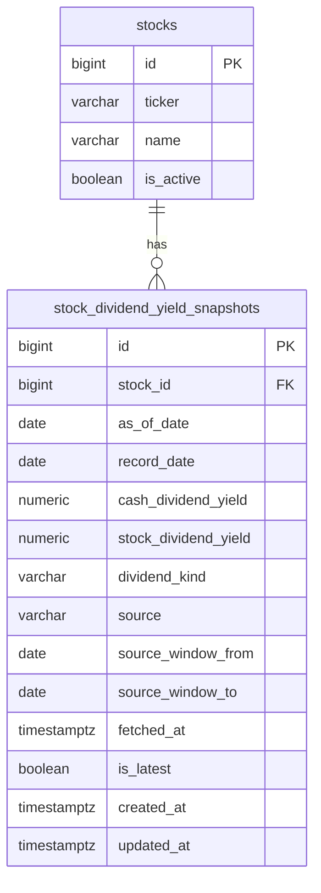

# Stock Dividend Yield Snapshot

## Summary
- `/api/stocks` dividend yield is now backed by a dedicated snapshot table.
- The table name is `stock_dividend_yield_snapshots`.
- This table is intentionally separate from `stock_financials`.

## Why A Separate Table
- Dividend yield is a time-sensitive snapshot value, not a quarterly/yearly financial statement field.
- `/api/stocks` needs fast latest-value lookup by stock.
- The snapshot table keeps daily upsert and fallback logic isolated from other financial domains.

## ERD

## Data Flow
1. KIS `ranking/dividend-rate` is fetched on the snapshot refresh schedule, including continuation pages while `tr_cont = M`.
2. A Redis snapshot is updated for quick fallback.
3. Matched stocks are persisted into `stock_dividend_yield_snapshots`.
4. `/api/stocks` reads the latest DB snapshot first and uses Redis only as fallback.

## Main Columns
- `stock_id`: FK to `stocks.id`
- `as_of_date`: snapshot date used for idempotent daily upsert
- `record_date`: base date returned by KIS
- `cash_dividend_yield`: current value exposed by `/api/stocks`
- `stock_dividend_yield`: reserved column for future stock-dividend support
- `dividend_kind`: KIS dividend kind
- `source`: source label, currently `KIS dividend-rate`
- `source_window_from`: KIS query window start
- `source_window_to`: KIS query window end
- `fetched_at`: actual refresh timestamp
- `is_latest`: latest-row marker used by `/api/stocks`

## Read Priority
- 1. DB latest snapshot
- 2. Redis snapshot fallback
- 3. `null`

## Migration
- Flyway file: `src/main/resources/db/migration/V8__create_stock_dividend_yield_snapshots.sql`
